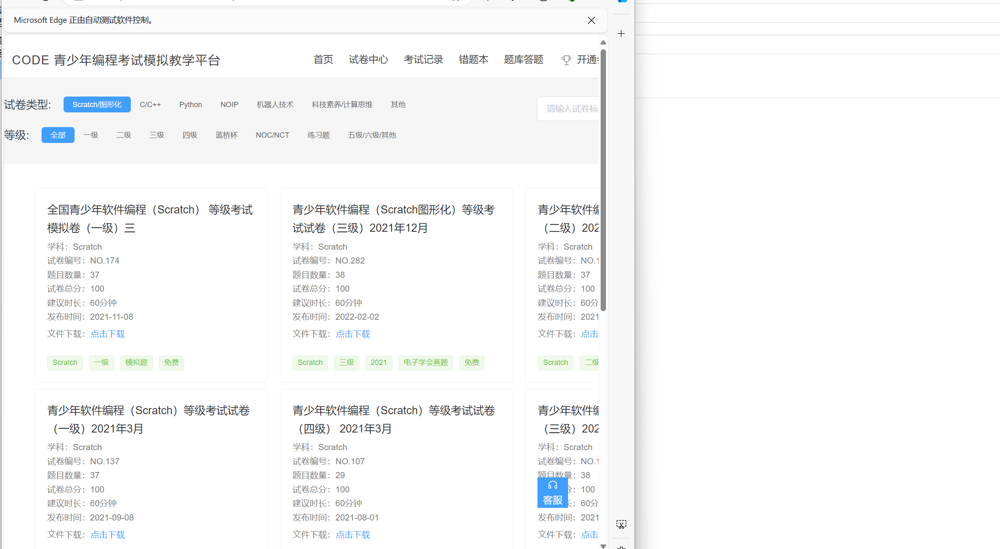
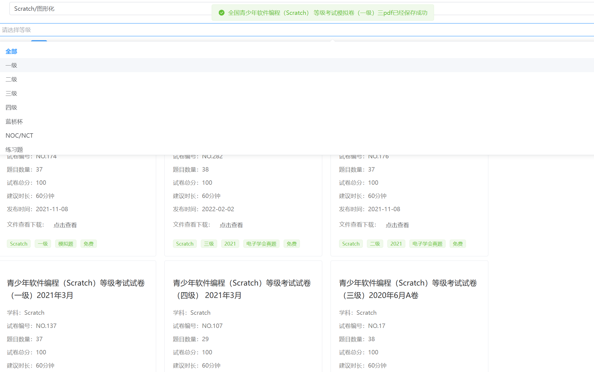

# Exam-spider
## 简介
基于python的爬虫，并结合vite前端展示，用于获取考试信息
## 运行环境
python3.12，vite
## 运行命令方法
```
打开终端
pip install -r requirements.txt
python app.py
cd vite_web
npm install  下载前端依赖
npm run dev 启动前端
```
## 配置
配置文件在config.py中，可自行修改
需要修改download_path为下载的路径
原站地址为(http://www.wancode.net/#/)
login_username和login_password为登录的账号密码，需要自行注册添加
## 效果图



只适用爬虫学习，请勿用于非法用途


